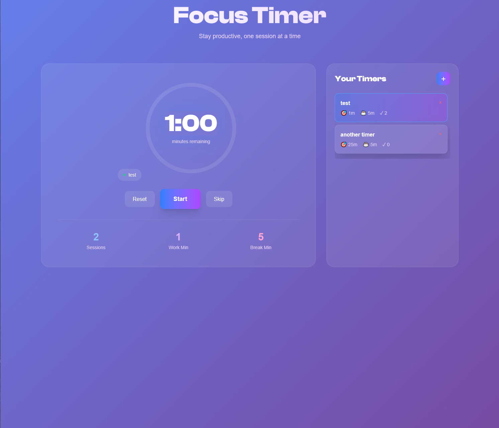

# About

This is a project that I created to get more practice with the Alpine.js library. It allows you to create pomodoro
timers in the browser and save them for later.

# Tech stack

- FastAPI
    - Web framework that serves the page and Jinja2 templates.
- Alpine.js
    - Adds interactivity for the timers and the ability to save timers in the browser.

# Screenshots

